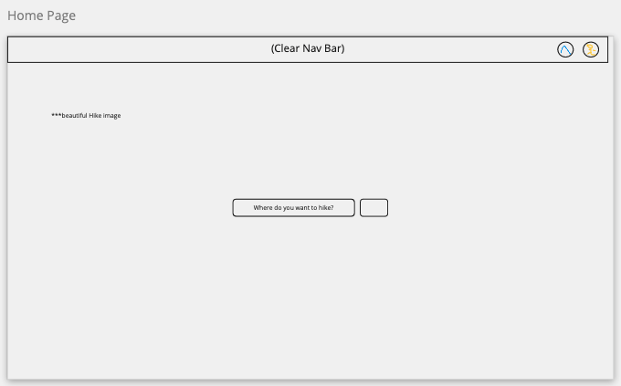
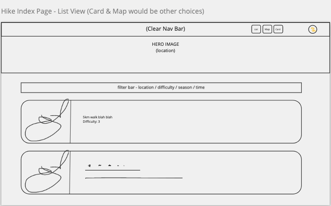
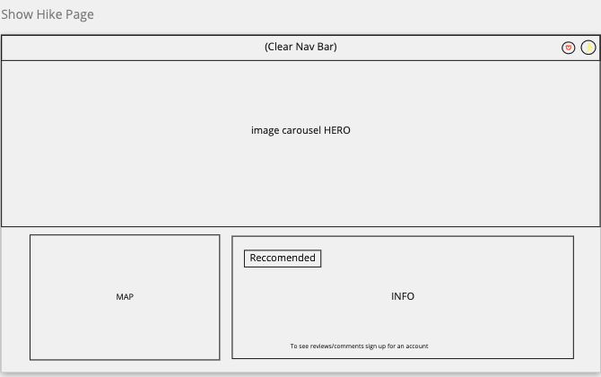
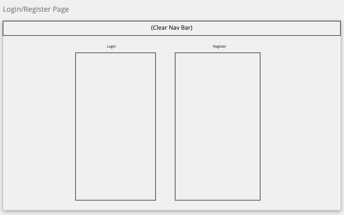
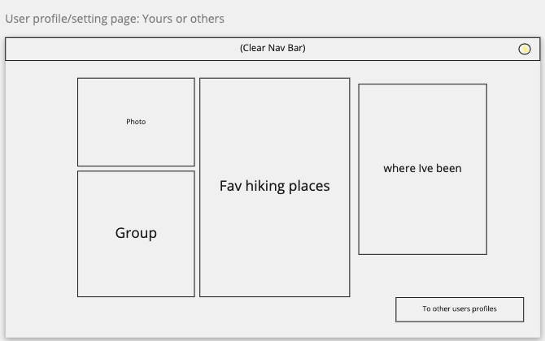
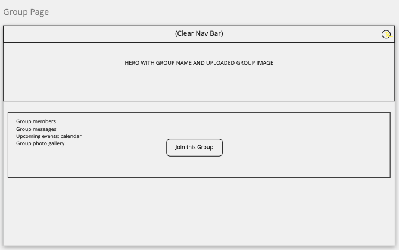
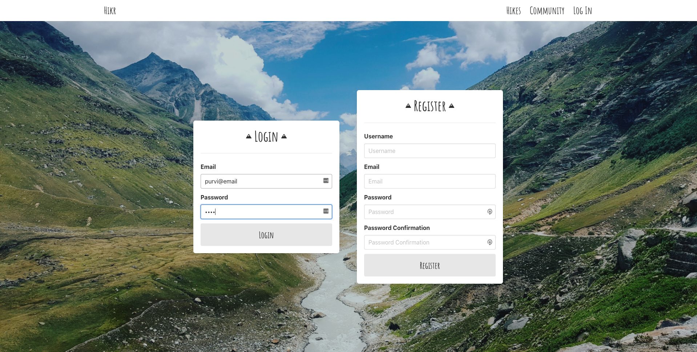
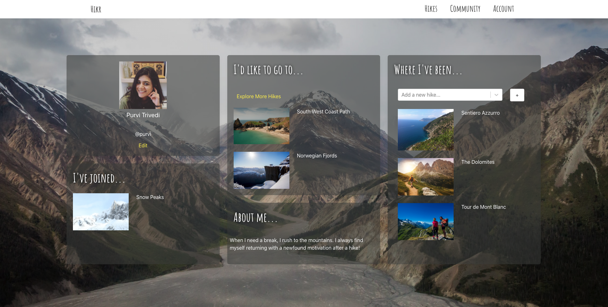

# General Assembly Project 2: Search + Play

**_Timeframe_**

9 Days

## Goal:

A group project to design a full-stack React app using Node.js, Express & MongoDB.

## Technologies Used

- React.js
- Node.js
- Express
- MongoDB/Mongoose
- SASS
- Bulma
- Axios
- React Mapbox GL
- Nodemon
- HTTP-proxy-middleware
- Bcrypt
- Body-parser
- jsonwebtoken
- Git/GitHub

# Hikr

A MERN-Stack Hike search & community app. Visitors can look up beautiful hikes in Europe and once registered they can leave reviews, ratings & add them to favourites or completed Hikes.

Registered users can also create & join Hiking Communities where they can chat with other members & create hiking events.

### Deployed version

https://hikrr.herokuapp.com/

Please use the following login credentials to explore the app:

- Email: _purvi@email_
- Password: _pass_

## Code Installation

https://github.com/purvitrivedi/sei-group-project-3

- Clone or download the repo
- Install dependencies by running <code>npm i in</code> Terminal
- Start the database by running <code>mongod --dbpath ~/data/db</code>
- Start the server by running <code>nodemon</code>
- Go to frontend folder using <code>cd frontend</code> terminal command
- Run the frontend using <code>npm run start</code>

## Planning

Since we were three group members, each of us decided to take ownership (Backend & Frontend) of the app. Andy did Hikes, Kuriko did Groups and I did user Authentication, Profiles & App Navigation.

### App Layout

Like project-2, we also planned out the user journey of Hikr on Miro.

     

# Process

As each of us had our own Backend areas to workon, we first planned out what models, controllers & routes each of us will be creating before moving on to code session. We also decided on which aspects of our models will be embedded or referenced.

Our notes are outlined in the next section with code examples.

## Backend (Day 1 to 3)

We had a strong start as the three of us finished the Backend within the first two days. On Day one, each of us worked on our models, controller and routes. On Day 2, we helped each other test and troubleshoot bugs.

### Models

**From initial notes**:

> **Hike**
>
> - Name | Location (lat/long)| Country | Description | Distance | Difficulty | Duration | Images | Seasons | User images (referenced) | Reviews(embedded) |Ratings (embedded)

> **Group**:
>
> - Group Name | Group Members (referenced))| Events: name, date, duration, selection of hikes (referenced) | image | User Images (embedded) | group chat (embedded)

> **User**:
>
> - Username | Email | Password & validation | Image | Bio | Completed Hikes(embedded) | Favourite Hikes (embedded) | Groups Joined (referenced)

Each model had embedded and referenced data in them. For example, for user model I added favorited hikes as embedded data:

        const favoriteHikesSchema = new mongoose.Schema({
          hike: { type: mongoose.Schema.ObjectId, ref: 'Hike', required: true }
        })

        const userSchema = new mongoose.Schema({
          username: { type: String, required: true, unique: true, maxlength: 50 },
          email: { type: String, required: true, unique: true },
          password: { type: String, required: true },
          fullName: { type: String },
          bio: { type: String },
          profileImage: { type: String },
          favoritedHikes: [favoriteHikesSchema],
          completedHikes: [completedHikesSchema]
        }
        )

Andy then referenced the favorited & completed hikes in the Hike model to show a logged in user if they had taken any actions with the hike they were viewing:

    hikeSchema
      .virtual('usersFavorited', {
        ref: 'User',
        localField: '_id',
        foreignField: 'favoritedHikes'
      })

**Another example:**

Kuriko created the group model, with members as embedded data:

    const groupMemberSchema = new mongoose.Schema({
      user: { type: mongoose.Schema.ObjectId, ref: 'User', required: true }
    }, {
      timestamps: true
    })

    const groupSchema = new mongoose.Schema({
      name: { type: String, required: true, unique: true },
      createdMember: { type: mongoose.Schema.ObjectId, ref: 'User', required: true },
      members: [ groupMemberSchema ],
      headerImage: { type: String, required: true },
      description: { type: String, required: true, maxlength: 500 },
      userAddedImages: [ userAddedImageSchema ],
      messages: [ groupMessageSchema ],
      events: [ eventSchema ]
    }, {
      timestamps: true
    })

I was then able to reference the Group model, so a profile would include the list of groups joined by the user:

        // * for groups joined by user
        userSchema
          .virtual('joinedGroups', {
            ref: 'Group',
            localField: '_id',
            foreignField: 'members.user'
          })

### Controllers

> Create, Read, Update and Delete Methods were written for:
>
> - Hikes, Reviews and Hike Images
> - Groups, Group Images, Chats, Events, Members
> - Login, Register, Profiles, user favorited Hikes and completed hikes

Since we had a lot of embedded and referenced data, we used array methods such as <code>flatMap</code> and <code>reduce</code> so we didn't populate unneccesary data in a request. For examples, in order to simply get the id of the groups a user has joined, I wrote this inside the <code>userShow</code> function:

    if (user.joinedGroups) {
      user.joinedGroups = user.joinedGroups.flatMap(item => item.\_id).reduce((arr,curr)  => {
      if (arr.length === 0) {
      arr.push(curr)
      }
      if (!arr.find(item => item.\_id === curr.\_id)) {
      arr.push(curr)
      }
      return arr
    }, [])

## Frontend (Day 4 to 8)

On day 4, we moved on to Frontend after setting up the React App, installing HTTP proxy middleware and Nodemon, we began our work on Hikes(Andy), Groups (Kuriko) and Users (me!).

For Authentication, I wanted a user to design the process like [Ableton's](https://www.ableton.com/en/login/), which meant:

- The Login and Register options were on the same page and;
- The used for logged in automatically after they registered.

To do this I ensured that the register and login controllers, both returned a token on the backend. On the frontend, once a user registered - I looged them and sent them to the Hikes page:

    handleSubmit = async (event, path) => {
      event.preventDefault()
      try {
        const res = await registerUser(this.state.formData)
        setToken(res.data.token)
        path.push('/hikes')

      } catch (err) {
        this.setState({ errors: err.response.data.errors })

      }
    }

For User Profile, I took the opportunity to explore **conditional rendering**. This meant:

- The user would never the leave the page when they wanted to make edits.
- The page would show different things based on a users actions

 

For example, on for the Bio on the user profile page:

    

      <h1 className="subtitle column is-full">About me...</h1>

      // * If "profile edit" is enabled, show the Edit Bio button

      {this.state.edit && 
Edit bio
}

      // * If showBio is true (i.e Edit Bio has not been clicked) - Show the Bio

      {this.state.showBio && 

      

      {profile.bio}
      

}

      // * If showBio is false, then show a text area input wher user can edit the bio:

      {!this.state.showBio &&
        

            <textarea
            className="textarea column"
            value={this.state.bio}
            onChange={this.handleChange}
            name="bio"
            />
            
Submit

        
}
    

The user profile page also showed different things based on whether the user was the owner of the profile. Fo example, for completed Hikes, the owner got an option to add Hikes from their profile page:

    

      
{completedHikes}

    

Other than working on app navigation, I also pair programmed with Andy on:

- Adding "Add to Favorites" button & 'Average Rating" on Hike Show Page
- Error handling and styling of forms on Hike and User profile pages.

An interesting thing we did for Average rating is use a **callback function**. This is so the average rating would not be calculated until we posted the rating AND recieved the updated Hike data from the backend.

    handleSubmitReview = async (event, rating, text) => {
      event.preventDefault()
      try {
        const hikeId = this.props.match.params.id
        await reviewHike(hikeId, { rating: rating, text: text })
        const res = await getSingleHike(hikeId)
        this.setState({ hike: res.data, errors: '', reviewText: '', reviewRating: '' },
          () => {
            this.getAverageRating()
          })
      } catch (err) {
        this.setState({ errors: JSON.parse(err.response.config.data) })
      }
    }

## Seeding (Day 9)

The final day was spent population the database with Hikes, Groups and Users. We ensured that Hikes and Groups were created by random users by writing this script in seeds.js:

    const hikesWithUsers = hikeData.map(hike => {
      return { ...hike, user: createdUsers[Math.floor(Math.random() * createdUsers.length)]._id }
    })

    const groupsWithUsers = groupData.map(group => {
      return { ...group, createdMember: createdUsers[Math.floor(Math.random() * createdUsers.length)]._id }
    })

## Challenges

**Planning**:

While we did a great job planning as a team, it was slightly challenging as I was still full trying to understand the difference between Embedded and Referenced Data. Fortunately, this was the perfect project to solidify my understanding in this area.

**Navigating from one user profile to another**:

This was an interesting challenge and I very much enjoyed solving it. 

**The problem **: If a user was checking out another user and then attempted to go to their own profile from the Navbar, they couldn't as the link structure was similar: /profile/:id

**Solution**: Using <code>componentDidUpdate</code> on the Profile component:

    componentDidUpdate = async (prevProps) => {
       if (prevProps.location.pathname.includes('/profiles/') && this.props.location.pathname.includes('/profiles/')) {
         if (this.props.location.pathname !== prevProps.location.pathname) {
           const id = this.props.match.params.id
           const res = await getUser(id)
           this.setState({ profile: res.data, bio: res.data.bio, image: res.data.profileImage, fullName: res.data.fullName })
         }
       }
     }

## Wins

Planning ✍️ : This one comes in under challenges and wins! While getting the right answer took some time, spending our Day 1 on planning alone meant we made a strong start and finished the backend in two days.

Features ✨: I'm very happy with the amount of work we got done in 9 days. The app offers tons of functionality whilst still having a strong user journey.

Styling 📱: The app is slick and responsive, something we were every keen on acheieving since Hiking websites don't usually have "beautiful" styling.

## Future Improvements

* Creating Group seeds with Group members: A challenge I wanted to solve but we ran out of time.
* Events Page Styling: Make this inline-with other pages
* Error Handling on the frontend

