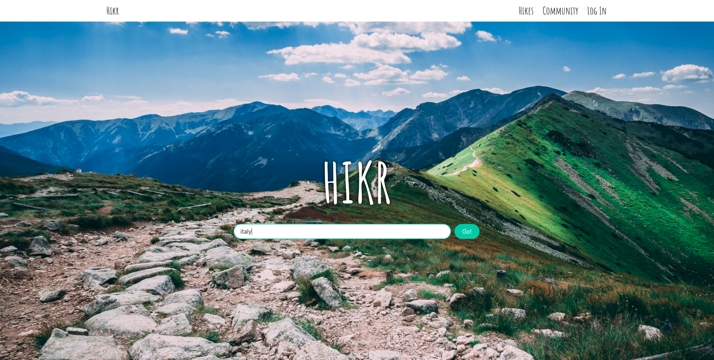
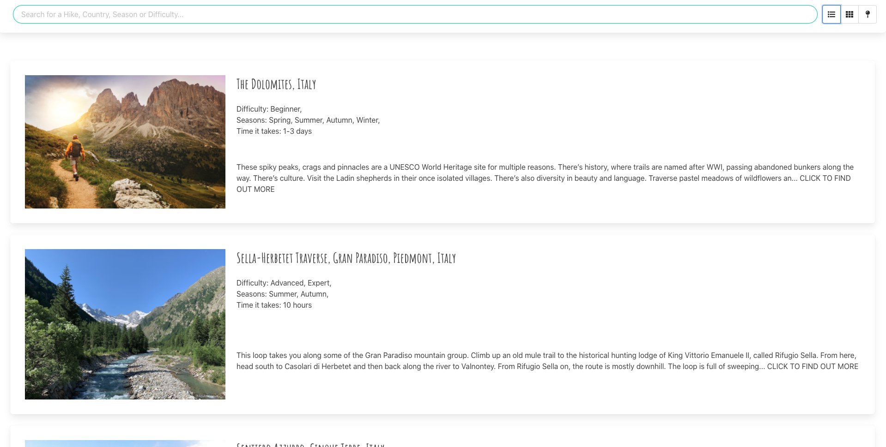
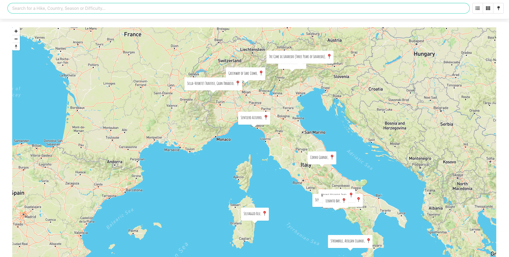
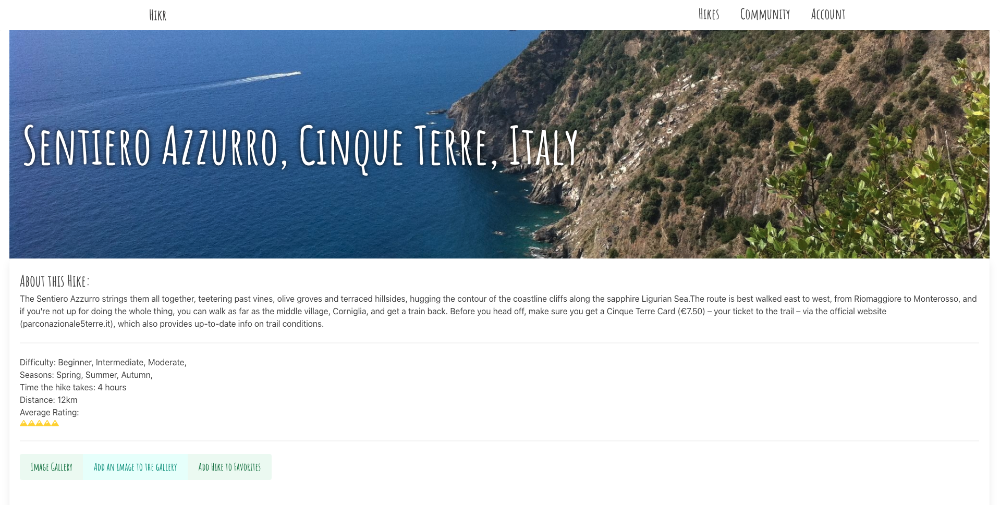
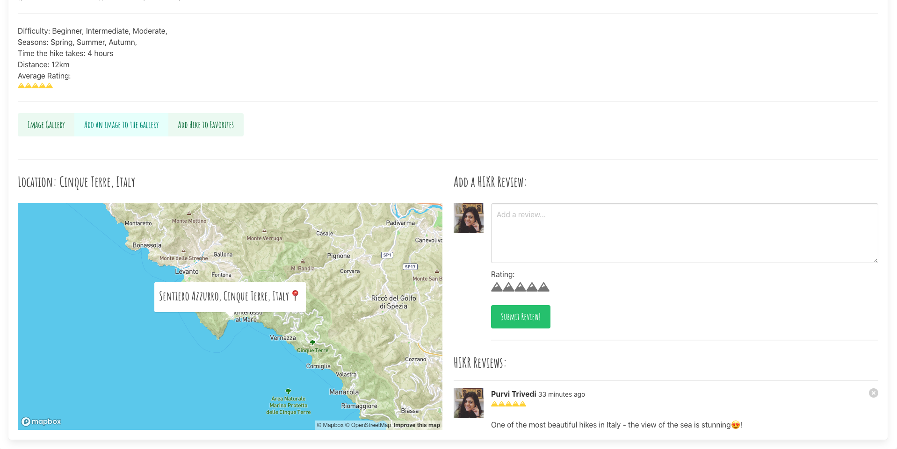
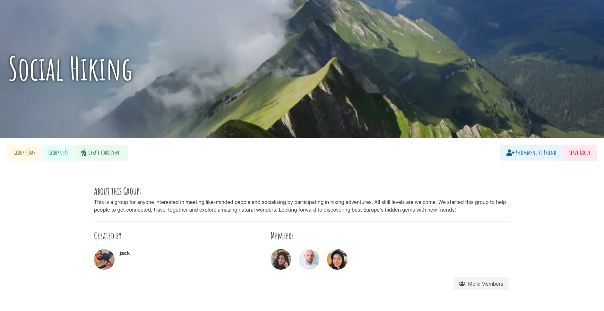
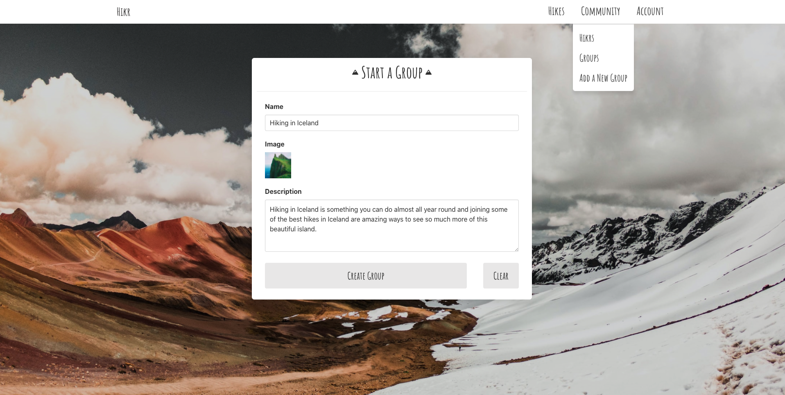

# General Assembly Project 2: Search + Play

**_Timeframe_**

9 Days

## Goal:

A group project to design a full-stack React app using Node.js, Express & MongoDB.

## Technologies Used

- React.js
- Node.js
- Express
- MongoDB/Mongoose
- SASS
- Bulma
- Axios
- React Mapbox GL
- Nodemon
- Bcrypt
- Body-parser
- jsonwebtoken
- Git/GitHub

# Hikr

A MERN-Stack Hike search & community app. Visitors can look up beautiful hikes in Europe and once registered they can leave reviews, ratings & add them to favourites or completed Hikes.

Registered users can also create & join Hiking Communities where they can chat with other members & create hiking events.

### Deployed version

https://hikrr.herokuapp.com/

## Code Installation

https://github.com/purvitrivedi/sei-group-project-3

- Clone or download the repo
- Install npm i in Terminal
- Start the database by running mongodb
- Start the server by running nodemon
- Go to frontend folder using <code>cd frontend</code> terminal command
- Run the frontend using npm run start

## Planning

Since we were three group members, each of us decided to take ownership (Backend & Frontend) of the app. Andy did Hikes, Kuriko did Groups and I did user Authentication, Profiles & App Navigation.

### App Layout

Like project-2, we also planned out the user journey of Hikr on Miro.

     

### App Pages

On Homepage, search for a country:

Explore Hikes in different views:

Login or register to unlock more features and view your profile:

 

View Hike in detail, leave rating & reviews, add to favorites:

 

Join or create a group:

 

Explore other Hikr Profiles:

## Process

As each of us had our own Backend areas to workon, we first planned out what models, controllers & routes each of us will be creating before moving on to code session.

### Backend

We had a strong start with Backend as the three of us finished the Backend within the first two days.

### Models

> **Hike**
> - Name | Location (lat/long)| Country | Description | Distance | Difficulty | Duration | Images | Seasons | User images (referenced) | Reviews(embedded) |Ratings (embedded)

> **Group**:
> - Group Name | Group Members (referenced))| Events: name, date, duration, selection of hikes (referenced) | image | User Images (embedded) | group chat (embedded)

> **User**:
> - Username | Email | Password & validation | Image | Bio | Completed Hikes(embedded) | Favourite Hikes (embedded)

### Controllers

> **Hikes**:
> - Create | Find by Id | Update | Delete | Review & Rating | Add image

> **Groups**:
> - Create | Find by Id | Update | Delete | Chat | Add Event

> **User**:

> - Read all users | Find by Id one User | Update User | Delete User | Add Fav & Completed Hikes | Delete Fav & Completed Hikes | Login | Register

### Routes

> - /hikes | Index page | GET/POST
> - /hikes/:id | Hike show page |  GET/PUT/DELETE
> - /hikes/:id/comments | Hike reviews | POST
> - /hikes/:id/comments/:id | Delete review | DELETE

> - /groups groups | Index page | GET/POST
> - /groups/:id group | Profile page | GET/PUT/DELETE
> - /groups/:id/messages Groups chat |  POST
> - /groups/:id/messages/:id | delete/edit chat | DELETE/PUT
> - /groups/:id/events | Index and Create events | GET/POST  
> - /groups/:id/events/:id | See/edit/delete event | GET/PUT/DELETE

> - /profiles | index of users | GET
> - /profiles/:username | Users profile pages |  GET/POST/PUT/DELETE
> - /register - POST
> - /login - POST

### Frontend

## Wins

## Challenges

## Future Improvements

