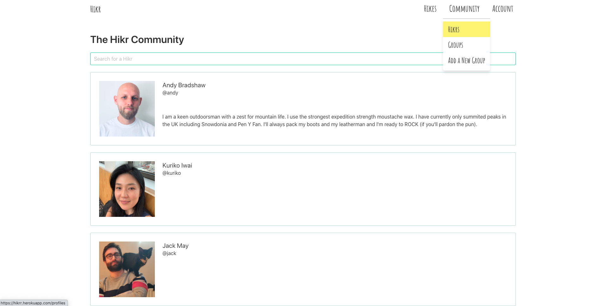

# General Assembly Project 2: Search + Play

**_Timeframe_**

9 Days

## Goal:

A group project to design a full-stack React app using Node.js, Express & MongoDB.

## Technologies Used

- React.js
- Node.js
- Express
- MongoDB/Mongoose
- SASS
- Bulma
- Axios
- React Mapbox GL
- Nodemon
- Bcrypt
- Body-parser
- jsonwebtoken
- Git/GitHub

# Hikr

A MERN-Stack Hike search & community app. Visitors can look up beautiful hikes in Europe and once registered they can leave reviews, ratings & add them to favourites or completed Hikes.

Registered users can also create & join Hiking Communities where they can chat with other members & create hiking events.

### Deployed version

https://hikrr.herokuapp.com/

## Code Installation

https://github.com/purvitrivedi/sei-group-project-3

- Clone or download the repo
- Install npm i in Terminal
- Start the database by running mongodb
- Start the server by running nodemon
- Go to frontend folder using <code>cd frontend</code> terminal command
- Run the frontend using npm run start

## Planning

Since we were three group members, each of us decided to take ownership (Backend & Frontend) of the app. Andy did Hikes, Kuriko did Groups and I did user Authentication, Profiles & App Navigation.

### App Layout

Like project-2, we also planned out the user journey of Hikr on Miro.

     

## Process

As each of us had our own Backend areas to workon, we first planned out what models, controllers & routes each of us will be creating before moving on to code session. We also decided on which aspects of our models will be embedded or referenced.

Our notes are outlined in the next section with code examples.

### Backend

We had a strong start as the three of us finished the Backend within the first two days. On Day one, each of us worked on our models, controller and routes. On Day 2, we helped each other test and troubleshoot bugs.

### Models

**From initial notes**:

> **Hike**
> - Name | Location (lat/long)| Country | Description | Distance | Difficulty | Duration | Images | Seasons | User images (referenced) | Reviews(embedded) |Ratings (embedded)

> **Group**:
> - Group Name | Group Members (referenced))| Events: name, date, duration, selection of hikes (referenced) | image | User Images (embedded) | group chat (embedded)

> **User**:
> - Username | Email | Password & validation | Image | Bio | Completed Hikes(embedded) | Favourite Hikes (embedded) | Groups Joined (referenced) 

Each model had embedded and referenced data in them. For example, for user model I added favorited and completed as embedded data:

        const favoriteHikesSchema = new mongoose.Schema({
          hike: { type: mongoose.Schema.ObjectId, ref: 'Hike', required: true }
        })

        const completedHikesSchema = new mongoose.Schema({
          hike: { type: mongoose.Schema.ObjectId, ref: 'Hike', required: true }
        })

        const userSchema = new mongoose.Schema({
          username: { type: String, required: true, unique: true, maxlength: 50 },
          email: { type: String, required: true, unique: true },
          password: { type: String, required: true },
          fullName: { type: String },
          bio: { type: String },
          profileImage: { type: String },
          favoritedHikes: [favoriteHikesSchema], 
          completedHikes: [completedHikesSchema]
        }
        )

Andy then referenced the favorited & completed hikes in the Hike model to show a logged in user if they had taken any actions with the hike they were viewing:

    hikeSchema
      .virtual('usersFavorited', {
        ref: 'User',
        localField: '_id',
        foreignField: 'favoritedHikes'
      })

Another example us when Kuriko created the groups schema, with members in them:

    const groupMemberSchema = new mongoose.Schema({
      user: { type: mongoose.Schema.ObjectId, ref: 'User', required: true }
    }, {
      timestamps: true
    })

    const groupSchema = new mongoose.Schema({
      name: { type: String, required: true, unique: true },
      createdMember: { type: mongoose.Schema.ObjectId, ref: 'User', required: true },
      members: [ groupMemberSchema ],
      headerImage: { type: String, required: true }, 
      description: { type: String, required: true, maxlength: 500 },
      userAddedImages: [ userAddedImageSchema ],
      messages: [ groupMessageSchema ],
      events: [ eventSchema ]
    }, {
      timestamps: true
    })

I was then able to reference the Group model, so a profile would include what groups were joined by the user:

        // * for groups joined by user
        userSchema
          .virtual('joinedGroups', {
            ref: 'Group',
            localField: '_id',
            foreignField: 'members.user'
          })

### Controllers

**From initial notes**:

> Create, Read, Update and Delete Methods need to be written for:
> * Hikes, Reviews and Hike Images
> * Groups, Group Images, Chats, Events, Members
> * Login, Register, Profiles, user favorited Hikes and completed hikes

### Routes

> - /hikes | Index page | GET/POST
> - /hikes/:id | Hike show page |  GET/PUT/DELETE
> - /hikes/:id/comments | Hike reviews | POST
> - /hikes/:id/comments/:id | Delete review | DELETE

> - /groups groups | Index page | GET/POST
> - /groups/:id group | Profile page | GET/PUT/DELETE
> - /groups/:id/messages Groups chat |  POST
> - /groups/:id/messages/:id | delete/edit chat | DELETE/PUT
> - /groups/:id/events | Index and Create events | GET/POST  
> - /groups/:id/events/:id | See/edit/delete event | GET/PUT/DELETE

> - /profiles | index of users | GET
> - /profiles/:username | Users profile pages |  GET/POST/PUT/DELETE
> - /register - POST
> - /login - POST

### Frontend

## Wins

## Challenges

### App Pages

On Homepage, search for a country:

Explore Hikes in different views:

Login or register to unlock more features and view your profile:

 

View Hike in detail, leave rating & reviews, add to favorites:

 

Join or create a group:

 

Explore other Hikr Profiles:

## Future Improvements

